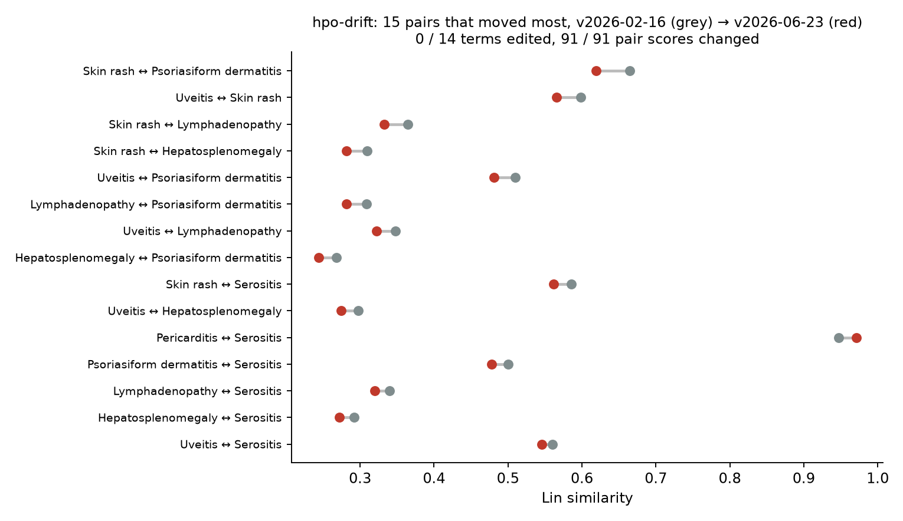
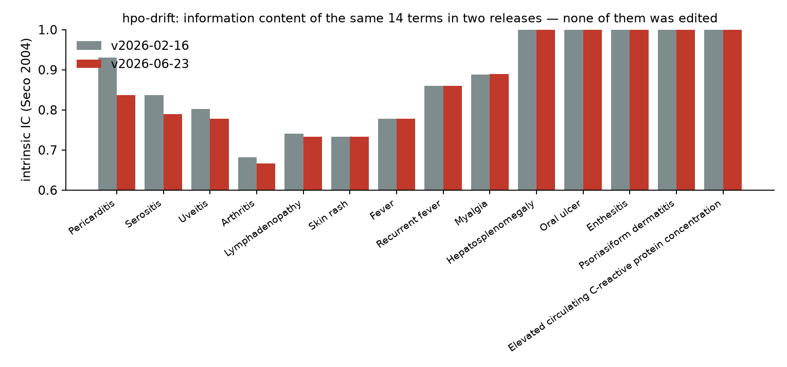
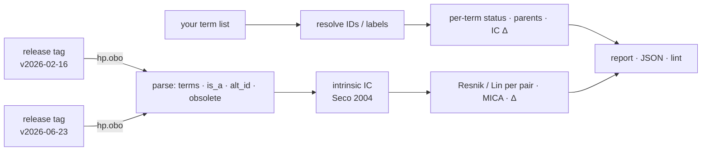

# hpo-drift

[](https://github.com/MargoSolo/hpo-drift/actions/workflows/drift.yml)


**What did a new HPO release change for *your* phenotype terms — and by how much did your similarity scores move?**

The Human Phenotype Ontology is updated roughly monthly. Terms get renamed, obsoleted and merged — and, the part nobody notices, the hierarchy gets new edges. New edges change information content, and information content is what Resnik and Lin similarity are made of. So the **same patient set, scored against two HPO releases, gives different numbers even if none of your terms were touched.** `hpo-drift` shows you exactly that, for the term list you actually use, in about three seconds.

## The headline result

Feb 2026 → Jun 2026, 14 paediatric-rheumatology terms. **Not one of them was edited** — no rename, no parent change. And yet:



**91 of 91 pairwise scores moved.** Ontology-wide the release added 469 terms, obsoleted 22, renamed 266 and rewired the `is_a` graph by +886 / −185 edges. That is what moved your numbers.



**Consequence for any paper using HPO similarity:** pin the release tag in Methods, match on IDs (266 labels changed in four months), and report how much the numbers depend on the release. `hpo-drift` gives you that sentence with real figures.

## 30-second start

```bash
pip install git+https://github.com/MargoSolo/hpo-drift

# one term per line — HP IDs (recommended) or labels
hpo-drift report --old v2026-02-16 --new v2026-06-23 --terms my_terms.txt
```
```
active terms: 19389 → 19836 (added 469, obsoleted 22, renamed 266)
is_a edges:   +886 / −185

term        label          status     IC old → new
HP:0001701  Pericarditis   unchanged  0.930 → 0.837
HP:0045073  Serositis      unchanged  0.837 → 0.790
…
pair                                    Lin old → new   Δ       MICA
Skin rash ↔ Psoriasiform dermatitis     0.667 → 0.621   −0.045  HP:0000951
…
```
Add `--json` for a machine-readable report. Releases are pulled from the official GitHub assets of `obophenotype/human-phenotype-ontology`; any tag like `v2026-06-23` works and is cached under `~/.cache/hpo-drift`.

## Three things it does

### 1 · `report` — the drift itself
Per term: status (`unchanged` / `renamed` / `obsoleted` → replacement / `merged` / `missing`), label change, parents added or removed, IC before and after. Per pair: Resnik and Lin in both releases, the delta, and the most-informative common ancestor — so you can see *why* a pair moved. Plus the ontology-wide counts.

### 2 · `lint` — hygiene for a term list
```bash
hpo-drift lint --release v2026-06-23 --terms my_terms.txt
```
```
⚠️ Arthritis: matched by LABEL — labels get renamed; store the ID → HP:0001369
❌ Dactylitis: label not found (exact match on names/synonyms)
❌ HP:0002960: OBSOLETE → replaced_by HP:0025095
```
Exit code 1 on errors, so it works as a CI gate for a phenotype spreadsheet. Matching is **exact** on purpose: it reproduces the failure mode of a pipeline that matches by label. In the example set, "Dactylitis" does not exist as a single HPO term (it is split into finger and toe dactylitis) and "Macrophage activation syndrome" is a disease-level concept, not an HPO phenotype — both are reasons to store IDs, and reasons why fuzzy resolution must suggest, never auto-map.

### 3 · a monthly GitHub Action
`.github/workflows/drift.yml` fetches the latest release, compares it with your pinned one (`PINNED_HPO`) and uploads the report. Add a threshold on `lin_delta` from the JSON and it becomes a failing check.

## How it works



IC is **intrinsic** (Seco et al. 2004: `1 − log(descendants+1)/log(N)`), so it depends only on the graph — the drift measured here is caused purely by ontology edits, which is the effect this tool isolates. Annotation-based IC (from `phenotype.hpoa`) adds a second, independent source of drift and is on the roadmap as an option.

## Companion tools

- [`hpotools`](https://github.com/MargoSolo/hpotools) — HPO in R: release-pinned loading, similarity, Phenomizer-style ranking, enrichment.
- [`awesome-human-phenotype-ontology`](https://github.com/MargoSolo/awesome-human-phenotype-ontology) — link-verified list of HPO tools.

## Roadmap

`--ic annotations` · fuzzy label suggestions in `lint` · Phenopackets v2 export · `--pairs` file for patient × disease scoring · JOSS paper.

## Cite

Solosenko M. *hpo-drift: quantifying the effect of HPO release changes on phenotype-similarity results.* 2026, v0.1.0. MIT License.
