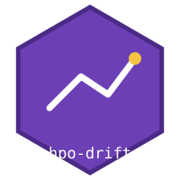
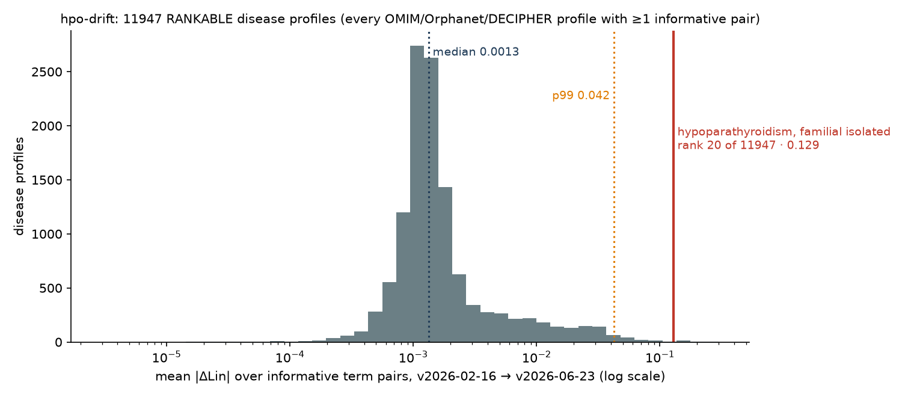
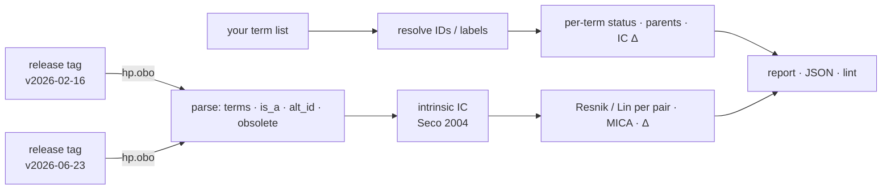

# hpo-drift 

[](https://github.com/MargoSolo/hpo-drift/actions/workflows/ci.yml)
[](https://doi.org/10.5281/zenodo.22286170)
[](https://github.com/MargoSolo/hpo-drift/actions/workflows/drift.yml)
 


**What did a new HPO release change for *your* phenotype terms — and by how much did your similarity scores move?**

The Human Phenotype Ontology is updated regularly. Terms get renamed, obsoleted and merged — and, the part nobody notices, the hierarchy gets new edges. New edges change information content, and information content is what Resnik and Lin similarity are made of. So **the same HPO term set can yield different semantic-similarity values across releases, even if none of your terms were touched** — and, through Best Match Average scoring, a different position of a disease in a patient's differential-diagnosis list. `hpo-drift` shows you exactly that, for the term list you actually use, in about three seconds.

## The headline result

**Same patient. Same disease annotations. Different HPO release.** Does the diagnosis move?

`examples/sweep_synthetic_patients.py`, protocol declared before running: 500 synthetic patients, each a random 60 % of one disease's `phenotype.hpoa` terms (at least 3) plus 2 random noise terms, drawn with seed 0 from all 12 935 disease profiles, no size filter. Each patient is scored (symmetric Best Match Average of Lin, Seco intrinsic IC) against **every** disease profile in HPO v2026-02-16 and in v2026-06-23.

| endpoint | Noise-A: 2 random terms from the whole domain | Noise-B: 2 terms from neighbouring branches |
|---|---|---|
| true diagnosis changed rank | **1 / 500** (rank 4 → 5, cone-rod dystrophy 12) | **0 / 500** |
| top-1 disease changed | **0 / 500** | **0 / 500** |
| top-5 membership changed | 50 / 500 (10 %) | 43 / 500 (8.6 %) |
| true diagnosis at rank 1 | 486 → 486; within top 10: 498 → 498 | 485 → 485; within top 10: 500 → 500 |
| Spearman ρ of all 12 935 disease ranks | median 0.9997, min 0.973 | median 0.9998, min 0.894 |

So in both stress tests **the diagnostic ranking was robust** to the release change, while the raw numbers underneath it were not: every one of the 11 947 rankable disease profiles had at least one pairwise Lin score move (`hpo-drift cohort`, below), and a single removed `is_a` edge can take a pair from 0.94 to 0.00 (the familial-isolated-hypoparathyroidism example, below). The 10 % of patients whose top-5 list was reshuffled show where that raw drift does reach a result: not the first place, but the order of the differential just below it.

Full per-patient tables (kept terms, noise terms, ranks and scores in both releases): [Noise-A](examples/sweep-synthetic-patients-v2026-02-16_v2026-06-23.csv), [Noise-B](examples/sweep-synthetic-patients-neighbor-v2026-02-16_v2026-06-23.csv); summarise with `python examples/summarize_sweep.py <csv>`. Caveat stated once: a patient built from 60 % of the true disease's own annotations is an easy query (rank 1 in 97 % of cases), so this test bounds the effect for well-annotated presentations; sparser or noisier patients are one flag away (`--keep`, `--noise`, `--noise-mode`).

### Where the raw drift comes from: one edge, one profile

Familial isolated hypoparathyroidism (OMIM:146200), 11 phenotypic-abnormality terms from `phenotype.hpoa` (`examples/fih_omim146200_terms.txt`):


- **One term lost one parent.** *Hypocalcemic seizures* (`HP:0002199`) was `is_a` *Hypocalcemia* (`HP:0002901`) and `is_a` *Symptomatic seizures*; in v2026-06-23 the *Hypocalcemia* edge is gone (likewise under *Hypocalcemic tetany*). No label changed, nothing was obsoleted, the other 10 terms were not touched.
- Consequence: *Hypocalcemic seizures* ↔ *Hypocalcemia* went **0.94 → 0.00** — their most-informative common ancestor is now the root; ↔ *Hyperphosphatemia* 0.59 → 0.00. *Hypocalcemia* lost its last child and became a leaf (IC 0.888 → 1.000). All 14 informative pairs in the profile moved, 3 by more than 0.1; 41 pairs share only the root (ROOT_ONLY, 0 → 0).
- Whether the edit is right is an ontology-design question (a seizure *caused by* hypocalcemia is arguably not a *kind of* hypocalcemia). What `hpo-drift` shows is the size of its numerical footprint: this profile is 20th of 11 947 by mean |ΔLin| in the full cohort, and the same edit drives four of the top five.


**What to do with this:** pin the release tag in Methods, match on IDs, and report how much your numbers depend on the release — `hpo-drift report` gives the sentence, `hpo-drift rank-diseases` tells you whether it reached your ranking.



| rank | disease profile | retained terms | informative pairs | changed | mean \|ΔLin\| |
|---|---|---|---|---|---|
| 1 | Hypoparathyroidism, familial isolated 2 (OMIM:618883) | 4 | 6 | 6 | 0.298 |
| 2 | Deafness, autosomal recessive 37 (OMIM:607821) | 4 | 2 | 2 | 0.257 |
| 3 | Cortisone reductase deficiency 2 (OMIM:614662) | 7 | 4 | 4 | 0.243 |
| 4 | Familial isolated hypoparathyroidism due to agenesis of parathyroid gland (ORPHA:2239) | 8 | 12 | 12 | 0.214 |
| 5 | Pseudohypoparathyroidism type 2 (ORPHA:94090) | 12 | 20 | 20 | 0.209 |
| 6 | Cone-Rod dystrophy, X-linked, 2 (OMIM:300085) | 2 | 1 | 1 | 0.207 |
| 7 | Immunodeficiency 65, susceptibility to viral infections (OMIM:618648) | 5 | 6 | 6 | 0.175 |
| 8 | ACTH-independent macronodular adrenal hyperplasia 2 (OMIM:615954) | 12 | 8 | 8 | 0.172 |
| … | | | | | |
| **20** | **Hypoparathyroidism, familial isolated (OMIM:146200)** | 11 | 14 | 14 | 0.129 |
| 50 | Chronic granulomatous disease (ORPHA:379) | 22 | 95 | 95 | 0.067 |
| median of 11 947 | | | | | 0.0013 |

Reproduce (the annotation file is pinned: `phenotype.hpoa` from HPO release **v2026-06-23**, `#version: 2026-06-23`, SHA-256 `89004f85b253f980ffe84218d2c080665cbf67a57bbb322111d6a2db5eb31dff`; the script prints the version and hash of the file it was given):
```bash
curl -LO https://github.com/obophenotype/human-phenotype-ontology/releases/download/v2026-06-23/phenotype.hpoa
hpo-drift cohort --hpoa phenotype.hpoa --old v2026-02-16 --new v2026-06-23 --out all_profiles.csv   # every profile, ~30 s
hpo-drift rank all_profiles.csv --metric mean_abs_dlin > ranked.csv                                  # optional
```
Output as run on 2026-09-03: [`examples/cohort-v2026-02-16_v2026-06-23.csv`](examples/cohort-v2026-02-16_v2026-06-23.csv) (all 12 935 profiles with status, plus a `.meta.json` recording the annotation file's version and hash) and [`examples/ranked-v2026-02-16_v2026-06-23.csv`](examples/ranked-v2026-02-16_v2026-06-23.csv). Where familiar syndromes sit: X-linked agammaglobulinemia 0.033, autosomal dominant hyper-IgE syndrome 0.029, cystic fibrosis 0.023, Wiskott–Aldrich 0.020, Kabuki / Noonan / Marfan about 0.001.

## 30-second start

```bash
pip install hpo-drift

# one term per line — HP IDs (recommended) or labels
hpo-drift report --old v2026-02-16 --new v2026-06-23 --terms examples/fih_omim146200_terms.txt
```
```
IC: Seco 2004 intrinsic, on the is_a graph under root HP:0000118 (Phenotypic abnormality); N = 18690 → 19120
active terms: 19389 → 19836 (added 469, obsoleted 22, renamed 266)
is_a edges:   +886 / −185

term        label                  status     parents        IC old → new
HP:0002199  Hypocalcemic seizures  unchanged  −HP:0002901    1.000 → 1.000
HP:0002901  Hypocalcemia           unchanged  =              0.888 → 1.000
…
pair                                      Lin old → new   Δ       MICA
Hypocalcemic seizures ↔ Hypocalcemia      0.941 → 0.000   −0.941  HP:0002901 → HP:0000118
Hypocalcemic seizures ↔ Hyperphosphatemia 0.594 → 0.000   −0.594  HP:0003111 → HP:0000118
…
```
Add `--json` for a machine-readable report. Releases are pulled from the official GitHub assets of `obophenotype/human-phenotype-ontology`; any tag like `v2026-06-23` works and is cached under `~/.cache/hpo-drift`.

## Five things it does

### 1 · `report` — the drift itself
Per term: status (`unchanged` / `renamed` / `obsoleted` → replacement / `merged` / `missing`), label change, parents added or removed, IC before and after. Per pair: Resnik and Lin in both releases, the delta, and the most-informative common ancestor — so you can see *why* a pair moved. Plus the ontology-wide counts.

### 2 · `lint` — hygiene for a term list
```bash
hpo-drift lint --release v2026-06-23 --terms my_terms.txt
```
```
⚠️ Arthritis: matched by LABEL — labels get renamed; store the ID → HP:0001369
❌ Recurrent infection: label not found (exact match on names/synonyms; the term is 'Recurrent infections')
❌ HP:0002961: OBSOLETE term → replaced_by HP:0010701
```
Exit code 1 on errors, so it works as a CI gate for a phenotype spreadsheet. Matching is **exact** on purpose: it reproduces the failure mode of a pipeline that matches by label. Store IDs, not labels: 266 labels changed in this interval alone, and fuzzy resolution (roadmap) must suggest, never auto-map.

### 3 · `cohort` and `rank` — the whole annotation corpus, no cutoffs
```bash
hpo-drift cohort --hpoa phenotype.hpoa --old v2026-02-16 --new v2026-06-23 --out all_profiles.csv
hpo-drift rank all_profiles.csv --metric mean_abs_dlin --top 20
```
`cohort` computes the drift summary for **every disease with at least one positive phenotypic-abnormality annotation** in `phenotype.hpoa` — a profile is the unique HP ids of a disease's rows with aspect `P` and no `NOT` qualifier (in v2026-06-23: 12 956 disease ids in the file, 12 935 profiles, 21 ids have only negated or non-`P` rows; the sidecar `.meta.json` records both counts). There is no minimum or maximum size: a profile that cannot support pairwise analysis stays in the table with a status — `NO_USABLE_TERMS`, `TERM_ONLY` (IC drift only), `NO_INFORMATIVE_PAIRS` (every pair shares only the root) or `RANKABLE`. Columns: a mutually exclusive disposition of every raw term (`retained`, `unknown`, `new_only`, `missing_new`, `merged_or_alt`, `obsolete`, `out_of_domain` — they add up to `n_raw_terms`), IC changes, pairs split into informative and root-only, pairs changed and pairs moved by > 0.01 / > 0.1, mean and max |ΔLin|. `rank` is a separate, optional step over that complete table. `report` follows the same rules for any list you give it: 0, 1 or N terms, root-only pairs marked `ROOT_ONLY`, terms outside the root marked `OUT_OF_DOMAIN` with a pointer to `--root`. IDs and labels are resolved against **both** releases: a term that exists only in the new release is reported as `new-in-new` (not silently dropped), a label the two releases map to different ids as `ambiguous`, an unresolvable token as `unknown`.

**Provenance.** Every `hp.obo` is downloaded atomically, hashed, checked against the SHA-256 the official HPO GitHub release publishes for the asset, and cached only after that check; reports, JSON and `cohort` sidecars record the SHA-256 of both ontology inputs and of the annotation file.

### 4 · `profiles` and `rank-diseases` — the question a genomicist actually asks
```bash
hpo-drift profiles --query patient.txt --target disease.txt --old v2026-02-16 --new v2026-06-23
hpo-drift rank-diseases --query patient.txt --hpoa phenotype.hpoa --old v2026-02-16 --new v2026-06-23 --out ranks.csv
```
Set-to-set similarity between two term lists — symmetric **Best Match Average** of Lin (mean over query terms of their best match in the target, averaged with the reverse direction) — in both releases, with the query terms whose best match changed most. `rank-diseases` scores the query against **every** disease profile in `phenotype.hpoa` in each release and reports rank and score per disease, so you can see whether a differential-diagnosis list is stable across the release change. `examples/sweep_synthetic_patients.py` runs the clinical version of this question on synthetic patients: a random 60 % subset of a disease’s annotations plus 2 noise terms, scored against every disease in both releases; it records the rank of the true diagnosis in each release, top-1 changes, top-5 overlap and Spearman ρ.

### 5 · a monthly GitHub Action
`.github/workflows/drift.yml` fetches the latest release, compares it with your pinned one (`PINNED_HPO`) and uploads the report. Add a threshold on `lin_delta` from the JSON and it becomes a failing check.

## How it works



IC is **intrinsic** (Seco et al. 2004: `1 − log(descendants+1)/log(N)`), computed on the **`is_a` graph only**, with `N` and descendant counts taken inside the closure of a root — `HP:0000118` *Phenotypic abnormality* by default (`--root` to change; inheritance, frequency and modifier branches are excluded, and the root's IC is exactly 0). Every report states the method, the root and `N`. Because this IC depends only on the graph, the drift measured here is caused purely by ontology edits, which is the effect this tool isolates. Annotation-based IC (from `phenotype.hpoa`) adds a second, independent source of drift and is the next option on the roadmap — then the two can be shown side by side.

## Companion tools

- [`hpotools`](https://github.com/MargoSolo/hpotools) — HPO in R: release-pinned loading, similarity, Phenomizer-style ranking, enrichment.
- [`awesome-human-phenotype-ontology`](https://github.com/MargoSolo/awesome-human-phenotype-ontology) — link-verified list of HPO tools.

## Roadmap

`--ic annotations` · fuzzy label suggestions in `lint` · Phenopackets v2 export · `--pairs` file for patient × disease scoring · JOSS paper.

## Cite

DOI (all versions): [10.5281/zenodo.22286170](https://doi.org/10.5281/zenodo.22286170) — each release has its own version DOI on that Zenodo page; cite the version you ran (`hpo-drift --version`).

Soloshenko M. *hpo-drift: quantifying the effect of HPO release changes on phenotype-similarity results.* 2026. MIT License.
