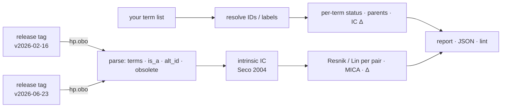

# hpo-drift 

[](https://github.com/MargoSolo/hpo-drift/actions/workflows/ci.yml)
[](https://doi.org/10.5281/zenodo.22286170)
[](https://github.com/MargoSolo/hpo-drift/actions/workflows/drift.yml)
 


**What did a new HPO release change for *your* phenotype terms — and by how much did your similarity scores move?**

The Human Phenotype Ontology is updated regularly. Terms get renamed, obsoleted and merged — and, the part nobody notices, the hierarchy gets new edges. New edges change information content, and information content is what Resnik and Lin similarity are made of. So the **same patient set, scored against two HPO releases, gives different numbers even if none of your terms were touched.** `hpo-drift` shows you exactly that, for the term list you actually use, in about three seconds.

## The headline result

Feb 2026 → Jun 2026. The example is the **HPO-annotated phenotype profile of chronic granulomatous disease** (ORPHA:379): 22 phenotypic-abnormality terms straight from `phenotype.hpoa`. I chose CGD because the mechanism of its drift is clinically interpretable and fits in two sentences. Then, as a sanity check, `hpo-drift cohort` ran over the **complete** `phenotype.hpoa` corpus — 12 935 disease profiles, no size cutoff: 11 947 have at least one informative pair, 705 are single-term, 283 have root-only pairs, all of them stay in the table with a status — and `hpo-drift rank` ordered the rankable ones by mean |ΔLin|. CGD landed **50th of 11 947** (median profile 0.0013, 99th percentile 0.043). The rows above it are mostly small profiles of 2–12 terms, where one re-parenting moves a handful of pairs a lot; many of them are immunodeficiencies, because the immunology branch was restructured in this interval.


What happened to this profile, computed with Seco intrinsic IC on the `is_a` graph under *Phenotypic abnormality*:

- **Two terms gained a parent.** HPO introduced an *Unusual infection* hierarchy: *Gingivitis* (`HP:0000230`) is now also an *Unusual oral cavity infection* (`HP:5210280`), *Sinusitis* (`HP:0000246`) also an *Unusual upper respiratory tract infection* (`HP:5210121`). No label changed, nothing was obsoleted.
- Consequence: *Gingivitis* gained a new path through the infection/immune hierarchy. Its Lin similarity with *Meningitis* went **0.00 → 0.55**, with *Recurrent respiratory infections* 0.00 → 0.46, with *Sepsis* 0.00 → 0.43 — their most-informative common ancestor is no longer the root but *Unusual infection*. *Sinusitis* ↔ *Recurrent respiratory infections* rose 0.48 → 0.78.
- **IC moved for 18 of 22 terms** (6 of them by more than 0.01; N also changed, 18 690 → 19 120, which by itself shifts non-leaf intrinsic IC even without a direct edit to the term, and the 4 leaves stay at 1). **All 95 informative pairs moved**, 15 of them by more than 0.1; the remaining 136 pairs share only the root (ROOT_ONLY, 0 → 0). Mean |ΔLin| 0.067; the median disease profile: 0.0013.


The edit is clinically intuitive: gingivitis and sinusitis now connect more explicitly to the infection hierarchy. But even a sensible ontology improvement changes the numerical representation of a CGD phenotype profile, without changing the input phenotype profile. **Pin the release tag in Methods, match on IDs, and report how much the numbers depend on the release.** `hpo-drift` gives you that sentence with real figures; `hpo-drift cohort` tells you where your disease of interest sits.


| rank | disease profile | retained terms | informative pairs | changed | mean \|ΔLin\| |
|---|---|---|---|---|---|
| 1 | Hypoparathyroidism, familial isolated 2 (OMIM:618883) | 4 | 6 | 6 | 0.298 |
| 2 | Deafness, autosomal recessive 37 (OMIM:607821) | 4 | 2 | 2 | 0.257 |
| 3 | Cortisone reductase deficiency 2 (OMIM:614662) | 7 | 4 | 4 | 0.243 |
| 4 | Familial isolated hypoparathyroidism due to agenesis of parathyroid gland (ORPHA:2239) | 8 | 12 | 12 | 0.214 |
| 5 | Pseudohypoparathyroidism type 2 (ORPHA:94090) | 12 | 20 | 20 | 0.209 |
| 6 | Cone-Rod dystrophy, X-linked, 2 (OMIM:300085) | 2 | 1 | 1 | 0.207 |
| 7 | Immunodeficiency 65, susceptibility to viral infections (OMIM:618648) | 5 | 6 | 6 | 0.175 |
| 8 | ACTH-independent macronodular adrenal hyperplasia 2 (OMIM:615954) | 12 | 8 | 8 | 0.172 |
| … | | | | | |
| **50** | **Chronic granulomatous disease (ORPHA:379)** | 22 | 95 | 95 | 0.067 |
| median of 11 947 | | | | | 0.0013 |

Reproduce (the annotation file is pinned: `phenotype.hpoa` from HPO release **v2026-06-23**, `#version: 2026-06-23`, SHA-256 `89004f85b253f980ffe84218d2c080665cbf67a57bbb322111d6a2db5eb31dff`; the script prints the version and hash of the file it was given):
```bash
curl -LO https://github.com/obophenotype/human-phenotype-ontology/releases/download/v2026-06-23/phenotype.hpoa
hpo-drift cohort --hpoa phenotype.hpoa --old v2026-02-16 --new v2026-06-23 --out all_profiles.csv   # every profile, ~30 s
hpo-drift rank all_profiles.csv --metric mean_abs_dlin > ranked.csv                                  # optional
```
Output as run on 2026-09-03: [`examples/cohort-v2026-02-16_v2026-06-23.csv`](examples/cohort-v2026-02-16_v2026-06-23.csv) (all 12 935 profiles with status, plus a `.meta.json` recording the annotation file's version and hash) and [`examples/ranked-v2026-02-16_v2026-06-23.csv`](examples/ranked-v2026-02-16_v2026-06-23.csv). Where familiar syndromes sit: X-linked agammaglobulinemia 0.033, autosomal dominant hyper-IgE syndrome 0.029, cystic fibrosis 0.023, Wiskott–Aldrich 0.020, Kabuki / Noonan / Marfan about 0.001.

## 30-second start

```bash
pip install hpo-drift

# one term per line — HP IDs (recommended) or labels
hpo-drift report --old v2026-02-16 --new v2026-06-23 --terms my_terms.txt
```
```
IC: Seco 2004 intrinsic, on the is_a graph under root HP:0000118 (Phenotypic abnormality); N = 18690 → 19120
active terms: 19389 → 19836 (added 469, obsoleted 22, renamed 266)
is_a edges:   +886 / −185

term        label        status     parents        IC old → new
HP:0000230  Gingivitis   unchanged  +HP:5210280    1.000 → 0.859
HP:0000246  Sinusitis    unchanged  +HP:5210121    1.000 → 0.880
…
pair                                   Lin old → new   Δ       MICA
Gingivitis ↔ Meningitis                0.000 → 0.553   +0.553  HP:0000118 → HP:0032158
Sinusitis ↔ Recurrent respiratory inf. 0.480 → 0.781   +0.301  HP:0012252 → HP:0011947
…
```
Add `--json` for a machine-readable report. Releases are pulled from the official GitHub assets of `obophenotype/human-phenotype-ontology`; any tag like `v2026-06-23` works and is cached under `~/.cache/hpo-drift`.

## Four things it does

### 1 · `report` — the drift itself
Per term: status (`unchanged` / `renamed` / `obsoleted` → replacement / `merged` / `missing`), label change, parents added or removed, IC before and after. Per pair: Resnik and Lin in both releases, the delta, and the most-informative common ancestor — so you can see *why* a pair moved. Plus the ontology-wide counts.

### 2 · `lint` — hygiene for a term list
```bash
hpo-drift lint --release v2026-06-23 --terms my_terms.txt
```
```
⚠️ Arthritis: matched by LABEL — labels get renamed; store the ID → HP:0001369
❌ Recurrent infection: label not found (exact match on names/synonyms; the term is 'Recurrent infections')
❌ HP:0002961: OBSOLETE term → replaced_by HP:0010701
```
Exit code 1 on errors, so it works as a CI gate for a phenotype spreadsheet. Matching is **exact** on purpose: it reproduces the failure mode of a pipeline that matches by label. Store IDs, not labels: 266 labels changed in this interval alone, and fuzzy resolution (roadmap) must suggest, never auto-map.

### 3 · `cohort` and `rank` — the whole annotation corpus, no cutoffs
```bash
hpo-drift cohort --hpoa phenotype.hpoa --old v2026-02-16 --new v2026-06-23 --out all_profiles.csv
hpo-drift rank all_profiles.csv --metric mean_abs_dlin --top 20
```
`cohort` computes the drift summary for **every disease with at least one positive phenotypic-abnormality annotation** in `phenotype.hpoa` — a profile is the unique HP ids of a disease's rows with aspect `P` and no `NOT` qualifier (in v2026-06-23: 12 956 disease ids in the file, 12 935 profiles, 21 ids have only negated or non-`P` rows; the sidecar `.meta.json` records both counts). There is no minimum or maximum size: a profile that cannot support pairwise analysis stays in the table with a status — `NO_USABLE_TERMS`, `TERM_ONLY` (IC drift only), `NO_INFORMATIVE_PAIRS` (every pair shares only the root) or `RANKABLE`. Columns: a mutually exclusive disposition of every raw term (`retained`, `unknown`, `new_only`, `missing_new`, `merged_or_alt`, `obsolete`, `out_of_domain` — they add up to `n_raw_terms`), IC changes, pairs split into informative and root-only, pairs changed and pairs moved by > 0.01 / > 0.1, mean and max |ΔLin|. `rank` is a separate, optional step over that complete table. `report` follows the same rules for any list you give it: 0, 1 or N terms, root-only pairs marked `ROOT_ONLY`, terms outside the root marked `OUT_OF_DOMAIN` with a pointer to `--root`. IDs and labels are resolved against **both** releases: a term that exists only in the new release is reported as `new-in-new` (not silently dropped), a label the two releases map to different ids as `ambiguous`, an unresolvable token as `unknown`.

**Provenance.** Every `hp.obo` is downloaded atomically, hashed, checked against the SHA-256 the official HPO GitHub release publishes for the asset, and cached only after that check; reports, JSON and `cohort` sidecars record the SHA-256 of both ontology inputs and of the annotation file.

### 4 · a monthly GitHub Action
`.github/workflows/drift.yml` fetches the latest release, compares it with your pinned one (`PINNED_HPO`) and uploads the report. Add a threshold on `lin_delta` from the JSON and it becomes a failing check.

## How it works



IC is **intrinsic** (Seco et al. 2004: `1 − log(descendants+1)/log(N)`), computed on the **`is_a` graph only**, with `N` and descendant counts taken inside the closure of a root — `HP:0000118` *Phenotypic abnormality* by default (`--root` to change; inheritance, frequency and modifier branches are excluded, and the root's IC is exactly 0). Every report states the method, the root and `N`. Because this IC depends only on the graph, the drift measured here is caused purely by ontology edits, which is the effect this tool isolates. Annotation-based IC (from `phenotype.hpoa`) adds a second, independent source of drift and is the next option on the roadmap — then the two can be shown side by side.

## Companion tools

- [`hpotools`](https://github.com/MargoSolo/hpotools) — HPO in R: release-pinned loading, similarity, Phenomizer-style ranking, enrichment.
- [`awesome-human-phenotype-ontology`](https://github.com/MargoSolo/awesome-human-phenotype-ontology) — link-verified list of HPO tools.

## Roadmap

`--ic annotations` · fuzzy label suggestions in `lint` · Phenopackets v2 export · `--pairs` file for patient × disease scoring · JOSS paper.

## Cite

DOI (all versions): [10.5281/zenodo.22286170](https://doi.org/10.5281/zenodo.22286170) — each release has its own version DOI on that Zenodo page; cite the version you ran (`hpo-drift --version`).

Soloshenko M. *hpo-drift: quantifying the effect of HPO release changes on phenotype-similarity results.* 2026. MIT License.
