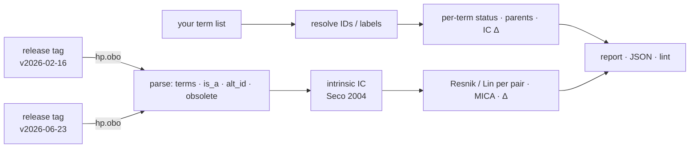

# hpo-drift 

[](https://github.com/MargoSolo/hpo-drift/actions/workflows/ci.yml)
[](https://doi.org/10.5281/zenodo.22286170)
[](https://github.com/MargoSolo/hpo-drift/actions/workflows/drift.yml)
 


**What did a new HPO release change for *your* phenotype terms — and by how much did your similarity scores move?**

The Human Phenotype Ontology is updated regularly. Terms get renamed, obsoleted and merged — and, the part nobody notices, the hierarchy gets new edges. New edges change information content, and information content is what Resnik and Lin similarity are made of. So the **same patient set, scored against two HPO releases, gives different numbers even if none of your terms were touched.** `hpo-drift` shows you exactly that, for the term list you actually use, in about three seconds.

## The headline result

Feb 2026 → Jun 2026. The example is the **HPO-annotated phenotype profile of chronic granulomatous disease** (ORPHA:379): 22 phenotypic-abnormality terms straight from `phenotype.hpoa`. I chose CGD because the mechanism of its drift is clinically interpretable and fits in two sentences. Then, as a sanity check, `examples/rank_profiles.py` ranked **every** OMIM and Orphanet profile with 12–60 terms present in both releases — 7121 profiles, one inclusion rule — by mean |ΔLin| over informative term pairs: CGD landed **12th** (median profile 0.001, 99th percentile 0.038). The upper part of that ranking is dominated by inborn errors of immunity; the immunology branch was restructured in this interval.


What happened to this profile, computed with Seco intrinsic IC on the `is_a` graph under *Phenotypic abnormality*:

- **Two terms gained a parent.** HPO introduced an *Unusual infection* hierarchy: *Gingivitis* (`HP:0000230`) is now also an *Unusual oral cavity infection* (`HP:5210280`), *Sinusitis* (`HP:0000246`) also an *Unusual upper respiratory tract infection* (`HP:5210121`). No label changed, nothing was obsoleted.
- Consequence: *Gingivitis* entered the immune branch. Its Lin similarity with *Meningitis* went **0.00 → 0.55**, with *Recurrent respiratory infections* 0.00 → 0.46, with *Sepsis* 0.00 → 0.43 — their most-informative common ancestor is no longer the root but *Unusual infection*. *Sinusitis* ↔ *Recurrent respiratory infections* rose 0.48 → 0.78.
- **IC moved for 18 of 22 terms; all 95 informative pairs moved**, 15 of them by more than 0.1 (136 pairs share only the root). Mean |ΔLin| 0.067; the median disease profile: 0.001.


The edit is clinically intuitive: gingivitis and sinusitis now connect more explicitly to the infection hierarchy. But even a sensible ontology improvement changes the numerical representation of a CGD phenotype profile, without changing the input phenotype profile. **Pin the release tag in Methods, match on IDs, and report how much the numbers depend on the release.** `hpo-drift` gives you that sentence with real figures; `examples/rank_profiles.py` tells you whether your disease of interest is among the exposed ones.


| rank | disease profile | terms | pairs moved | mean \|ΔLin\| |
|---|---|---|---|---|
| 1 | Pseudohypoparathyroidism type 2 (ORPHA:94090) | 12 | 20 / 20 | 0.209 |
| 2 | Cytomegalovirus disease in patients with impaired cell mediated immuni (ORPHA:137698) | 14 | 23 / 23 | 0.136 |
| 3 | Generalized glucocorticoid resistance syndrome (ORPHA:786) | 21 | 46 / 46 | 0.095 |
| 4 | Severe combined immunodeficiency, autosomal recessive, T cell-negative (OMIM:608971) | 15 | 61 / 61 | 0.085 |
| 5 | Leukocyte adhesion deficiency, type I (OMIM:116920) | 17 | 51 / 51 | 0.084 |
| 6 | Severe combined immunodeficiency, autosomal recessive, T cell-negative (OMIM:601457) | 16 | 60 / 60 | 0.082 |
| 7 | Recurrent infections associated with rare immunoglobulin isotypes defi (ORPHA:183675) | 47 | 660 / 660 | 0.073 |
| 8 | Scedosporiosis (ORPHA:449280) | 34 | 183 / 183 | 0.072 |
| **12** | **Chronic granulomatous disease (ORPHA:379)** | 22 | 95 / 95 | 0.067 |
| median of 7121 | | | | 0.001 |

Reproduce (the annotation file is pinned: `phenotype.hpoa` from HPO release **v2026-06-23**, `#version: 2026-06-23`, SHA-256 `89004f85b253f980ffe84218d2c080665cbf67a57bbb322111d6a2db5eb31dff`; the script prints the version and hash of the file it was given):
```bash
curl -LO https://github.com/obophenotype/human-phenotype-ontology/releases/download/v2026-06-23/phenotype.hpoa
python examples/rank_profiles.py v2026-02-16 v2026-06-23 phenotype.hpoa > profiles.csv
```
Output as run on 2026-09-03: [`examples/profiles-v2026-02-16_v2026-06-23.csv`](examples/profiles-v2026-02-16_v2026-06-23.csv). Where familiar syndromes sit in it: hyper-IgE syndrome 0.047, X-linked agammaglobulinemia 0.033, cystic fibrosis 0.023, Wiskott–Aldrich 0.020, Kabuki / Noonan / Marfan below 0.01.

## 30-second start

```bash
pip install hpo-drift

# one term per line — HP IDs (recommended) or labels
hpo-drift report --old v2026-02-16 --new v2026-06-23 --terms my_terms.txt
```
```
IC: Seco 2004 intrinsic, on the is_a graph under root HP:0000118 (Phenotypic abnormality); N = 18690 → 19120
active terms: 19389 → 19836 (added 469, obsoleted 22, renamed 266)
is_a edges:   +886 / −185

term        label        status     parents        IC old → new
HP:0000230  Gingivitis   unchanged  +HP:5210280    1.000 → 0.859
HP:0000246  Sinusitis    unchanged  +HP:5210121    1.000 → 0.880
…
pair                                   Lin old → new   Δ       MICA
Gingivitis ↔ Meningitis                0.000 → 0.553   +0.553  HP:0000118 → HP:0032158
Sinusitis ↔ Recurrent respiratory inf. 0.480 → 0.781   +0.301  HP:0012252 → HP:0011947
…
```
Add `--json` for a machine-readable report. Releases are pulled from the official GitHub assets of `obophenotype/human-phenotype-ontology`; any tag like `v2026-06-23` works and is cached under `~/.cache/hpo-drift`.

## Three things it does

### 1 · `report` — the drift itself
Per term: status (`unchanged` / `renamed` / `obsoleted` → replacement / `merged` / `missing`), label change, parents added or removed, IC before and after. Per pair: Resnik and Lin in both releases, the delta, and the most-informative common ancestor — so you can see *why* a pair moved. Plus the ontology-wide counts.

### 2 · `lint` — hygiene for a term list
```bash
hpo-drift lint --release v2026-06-23 --terms my_terms.txt
```
```
⚠️ Arthritis: matched by LABEL — labels get renamed; store the ID → HP:0001369
❌ Recurrent infection: label not found (exact match on names/synonyms; the term is 'Recurrent infections')
❌ HP:0002960: OBSOLETE → replaced_by HP:0025095
```
Exit code 1 on errors, so it works as a CI gate for a phenotype spreadsheet. Matching is **exact** on purpose: it reproduces the failure mode of a pipeline that matches by label. Store IDs, not labels: 266 labels changed in this interval alone, and fuzzy resolution (roadmap) must suggest, never auto-map.

### 3 · a monthly GitHub Action
`.github/workflows/drift.yml` fetches the latest release, compares it with your pinned one (`PINNED_HPO`) and uploads the report. Add a threshold on `lin_delta` from the JSON and it becomes a failing check.

## How it works



IC is **intrinsic** (Seco et al. 2004: `1 − log(descendants+1)/log(N)`), computed on the **`is_a` graph only**, with `N` and descendant counts taken inside the closure of a root — `HP:0000118` *Phenotypic abnormality* by default (`--root` to change; inheritance, frequency and modifier branches are excluded, and the root's IC is exactly 0). Every report states the method, the root and `N`. Because this IC depends only on the graph, the drift measured here is caused purely by ontology edits, which is the effect this tool isolates. Annotation-based IC (from `phenotype.hpoa`) adds a second, independent source of drift and is the next option on the roadmap — then the two can be shown side by side.

## Companion tools

- [`hpotools`](https://github.com/MargoSolo/hpotools) — HPO in R: release-pinned loading, similarity, Phenomizer-style ranking, enrichment.
- [`awesome-human-phenotype-ontology`](https://github.com/MargoSolo/awesome-human-phenotype-ontology) — link-verified list of HPO tools.

## Roadmap

`--ic annotations` · fuzzy label suggestions in `lint` · Phenopackets v2 export · `--pairs` file for patient × disease scoring · JOSS paper.

## Cite

DOI (all versions): 10.5281/zenodo.22286170 · this version: 10.5281/zenodo.22286739

Soloshenko M. *hpo-drift: quantifying the effect of HPO release changes on phenotype-similarity results.* 2026, v0.1.4. MIT License.
