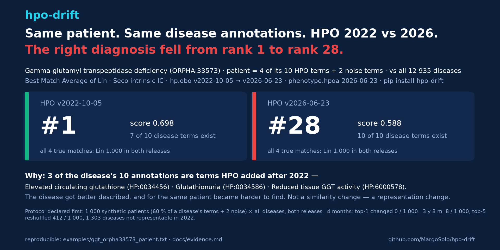

# hpo-drift 

[](https://github.com/MargoSolo/hpo-drift/actions/workflows/ci.yml)
[](https://pypi.org/project/hpo-drift/)
[](https://doi.org/10.5281/zenodo.22286170)
 

**Same patient, same disease annotations, different HPO release — does the diagnosis move?** `hpo-drift` computes your phenotype similarity twice, once per HPO release, and shows what changed and why.

```bash
pip install hpo-drift
```

## Three commands

**1 · Rank diseases for a patient in two releases.**
```bash
hpo-drift rank-diseases --query examples/ggt_orpha33573_patient.txt --hpoa phenotype.hpoa --old v2022-10-05 --new v2026-06-23
```
```
| disease                                              | score old → new | rank old → new |
| Gamma-glutamyl transpeptidase deficiency (ORPHA:33573) | 0.698 → 0.588 |   1 → 28      |
| Infantile choroidocerebral calcification (ORPHA:1313)  | 0.677 → 0.674 |   2 → 1       |
```
**2 · Explain it: patient vs one disease.**
```bash
hpo-drift profiles --query patient.txt --target disease.txt --old v2022-10-05 --new v2026-06-23
```
```
Query terms used 6 → 6 of 6; target 7 → 10 of 10.      ← 3 of the disease's terms did not exist in 2022
```
**3 · Your own term list: what changed, term by term and pair by pair.**
```bash
hpo-drift report --old v2026-02-16 --new v2026-06-23 --terms my_terms.txt
```
```
term        label                  status     parents        IC old → new
HP:0002199  Hypocalcemic seizures  unchanged  −HP:0002901    1.000 → 1.000
pair                                   Lin old → new   Δ       MICA old → new
Hypocalcemic seizures ↔ Hypocalcemia   0.941 → 0.000   −0.941  HP:0002901 → HP:0000118
```
Also: `lint` (a CI gate for a phenotype spreadsheet: label matches, obsolete ids, unknown tokens), `cohort` + `rank` (every disease profile in `phenotype.hpoa`, no size cutoff). Releases are pulled from the official HPO GitHub assets, verified against their published SHA-256, and cached. Any tag like `v2026-06-23` works.



## What we found

Protocol first, then numbers ([docs/evidence.md](docs/evidence.md)): 500 synthetic patients per run, each 60 % of one disease's annotations plus 2 noise terms, drawn from all 12 935 disease profiles, ranked against every disease in both releases.

| | 4 months (v2026-02 → v2026-06) | 3 y 8 m (v2022-10 → v2026-06) |
|---|---|---|
| top-1 diagnosis changed | 0 of 1 000 | 8 of 1 000 |
| top-5 list reshuffled | 93 of 1 000 | 412 of 1 000 |
| diseases not representable in the old release | 0 | 1 303 of 12 935 |

Over four months the ranking held. Over four years one patient in a hundred loses its top-1, two in five get a different differential, and a disease in ten cannot be queried with the old ontology at all — its annotations use terms that did not exist yet. The mechanism is usually not a similarity change but a representation change: gamma-glutamyl transpeptidase deficiency drops from rank 1 to 28 for the same patient because 3 of its 10 annotations are 2023+ terms. Underneath, the raw pairwise scores are never stable: every one of the 11 947 rankable disease profiles had at least one Lin score move even across the four-month interval.

**So:** pin the HPO release *and* the `phenotype.hpoa` version in Methods, match on IDs, and run `rank-diseases` across the releases your cohort spans before you call a ranking reproducible.

## Documentation

[Tutorial](docs/tutorial.md) · [Methods](docs/methods.md) (intrinsic IC, Best Match Average, resolution across releases, cohort semantics, provenance) · [Evidence](docs/evidence.md) (all sweeps, tables, mechanism) · [Changelog](CHANGELOG.md) · site: [margosolo.github.io/hpo-drift](https://margosolo.github.io/hpo-drift/)

## Companion tools

[`hpotools`](https://github.com/MargoSolo/hpotools) — HPO in R · [`awesome-human-phenotype-ontology`](https://github.com/MargoSolo/awesome-human-phenotype-ontology) — link-verified list of HPO tools.

## Cite

DOI (all versions): [10.5281/zenodo.22286170](https://doi.org/10.5281/zenodo.22286170) — each release has its own version DOI on that page; cite the version you ran (`hpo-drift --version`).

Soloshenko M. *hpo-drift: quantifying the effect of HPO release changes on phenotype-similarity results.* 2026. MIT License.
